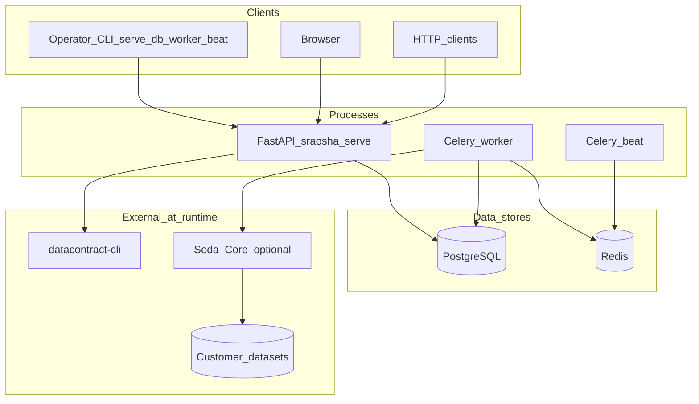
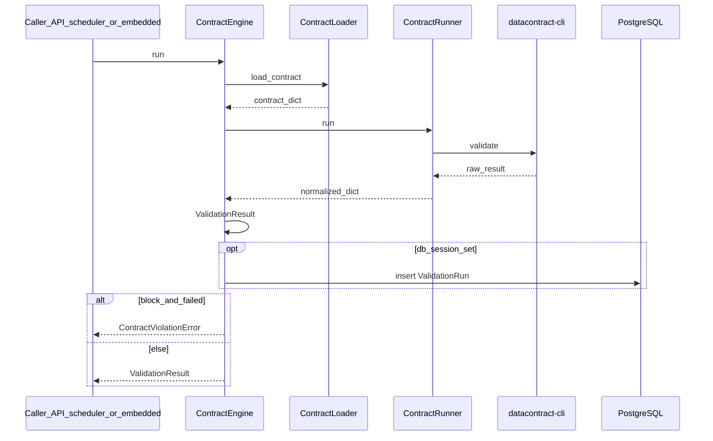

# Sraosha architecture

This document describes how the [`sraosha/`](sraosha) Python package is structured and how the main components interact. For product goals and contributor notes, see [README.md](README.md) and [CONTRIBUTING.md](CONTRIBUTING.md).

## System context

Sraosha is a **self-hosted** service: a FastAPI application (JSON API + optional **React SPA** under `/app/` when `sraosha/web/dist` or `frontend/dist` is present), optional **Celery** workers for scheduled jobs, **PostgreSQL** for persistence, and **Redis** as the Celery broker/backend. Contract validation uses **datacontract-cli**. Optional **Soda Core** checks (installed separately) power the data-quality module against configured database connections.

## Validation path

The [`ContractEngine`](sraosha/core/engine.py) loads YAML via [`ContractLoader`](sraosha/core/loader.py), runs [`ContractRunner`](sraosha/core/runner.py) (datacontract-cli), builds a [`ValidationResult`](sraosha/core/engine.py), and optionally persists a [`ValidationRun`](sraosha/models/run.py) when a DB session is provided. `block` enforcement raises [`ContractViolationError`](sraosha/core/engine.py) on failure.

## HTTP API and SPA

[`create_app()`](sraosha/api/app.py) mounts routers under `/api/v1` and serves the built SPA under `/app/` when present. `/` redirects to `/app/` or `/docs`. OpenAPI is at `/docs` and `/redoc`.

| Prefix | Router module | Purpose |
|--------|----------------|---------|
| `/api/v1/teams` | [`teams`](sraosha/api/routers/teams.py) | Teams |
| `/api/v1/alerting-profiles` | [`alerting_profiles`](sraosha/api/routers/alerting_profiles.py) | Notification profiles |
| `/api/v1/connections` | [`connections`](sraosha/api/routers/connections.py) | Stored connection credentials for validation and DQ |
| `/api/v1/contracts` | [`contracts`](sraosha/api/routers/contracts.py) | Contract CRUD and validation triggers |
| `/api/v1/runs` | [`runs`](sraosha/api/routers/runs.py) | Validation run history |
| `/api/v1/schedules` | [`schedules`](sraosha/api/routers/schedules.py) | Validation schedules |
| `/api/v1/data-quality` | [`data_quality`](sraosha/api/routers/data_quality.py) | DQ checks and runs (Soda) |
| `/app/*` | [`spa`](sraosha/api/spa.py) | Static React build (`sraosha/web/dist` in the wheel, or `frontend/dist` in a checkout) |

Optional API authentication: if `API_KEY` is set in settings, routes using [`verify_api_key`](sraosha/api/deps.py) require the `X-API-Key` header.

## Celery topology

Use **one** Celery **beat** process (periodic scheduler) and **one or more** **worker** processes. Docker Compose maps this to `beat` and `worker` services. CLI entrypoints: [`sraosha worker`](sraosha/cli/main.py) and [`sraosha beat`](sraosha/cli/main.py).

Periodic tasks are defined in [`celery_app.py`](sraosha/tasks/celery_app.py):

| Beat key | Task | Schedule |
|----------|------|----------|
| `check-validation-schedules` | `sraosha.tasks.validation_scheduler.check_validation_schedules` | Every 60 seconds |
| `check-dq-schedules` | `sraosha.tasks.dq_scheduler.check_dq_schedules` | Every 60 seconds |

## Data quality (Soda)

[`sraosha/dq/`](sraosha/dq/) integrates **Soda Core** lazily: install `soda-core` and the connector packages you need in your environment (they are not declared in `pyproject.toml`). DQ checks are stored per team/connection; runs are executed via Celery ([`dq_scan`](sraosha/tasks/dq_scan.py)) and exposed under `/api/v1/data-quality`. This is separate from datacontract-cli validation but complements it for database-native checks.

## Package map

| Path | Role |
|------|------|
| [`sraosha/core/`](sraosha/core/) | Contract loading, validation runner, credentials resolution |
| [`sraosha/api/`](sraosha/api/) | FastAPI app, routers, SPA static mount, contract YAML helpers |
| [`sraosha/services/`](sraosha/services/) | Shared domain helpers (DQ queries, schedules) |
| [`sraosha/models/`](sraosha/models/) | SQLAlchemy models |
| [`sraosha/schemas/`](sraosha/schemas/) | Pydantic request/response models |
| [`sraosha/dq/`](sraosha/dq/) | Soda-backed DQ runner and check configuration |
| [`sraosha/alerting/`](sraosha/alerting/) | Slack, email, dispatch |
| [`sraosha/tasks/`](sraosha/tasks/) | Celery app and task modules |
| [`sraosha/cli/`](sraosha/cli/) | Typer CLI |
| [`sraosha/db.py`](sraosha/db.py) | Async SQLAlchemy engine and session factory |
| [`sraosha/config.py`](sraosha/config.py) | `SraoshaSettings` and config file resolution |

## Database migrations

Schema changes are managed with **Alembic**. The CLI command `sraosha db` runs `alembic upgrade head` (see [`cli/main.py`](sraosha/cli/main.py)).
